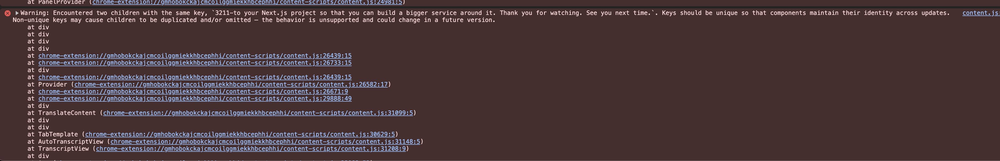
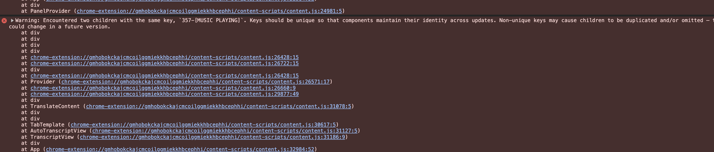
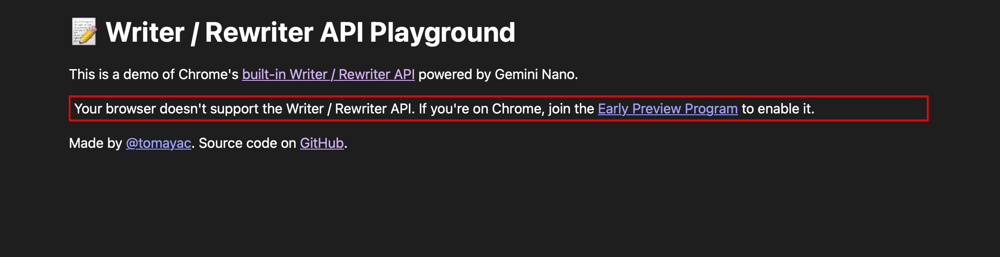

test url: https://www.youtube.com/watch?v=tF70o1Q8VkM&t=1s

# integrate transcript to translate

- unique key (test url:https://www.youtube.com/watch?v=n2CV6f0vFr4 )
  
- P1 add translate language selector [feng]
  

# UI fixes

# other issue

0. cache translate & summary

1. translate

2. QA [nan]

- QA is not done
- support user to ask question [nan]

3. detect chrome ai availablitiy UI [feng]

- checkAICapabilities
  

4. build [nan]

- app info
- app icon

# submission [nan]

1. Video
2. Description
3. Github readme
4. Article
