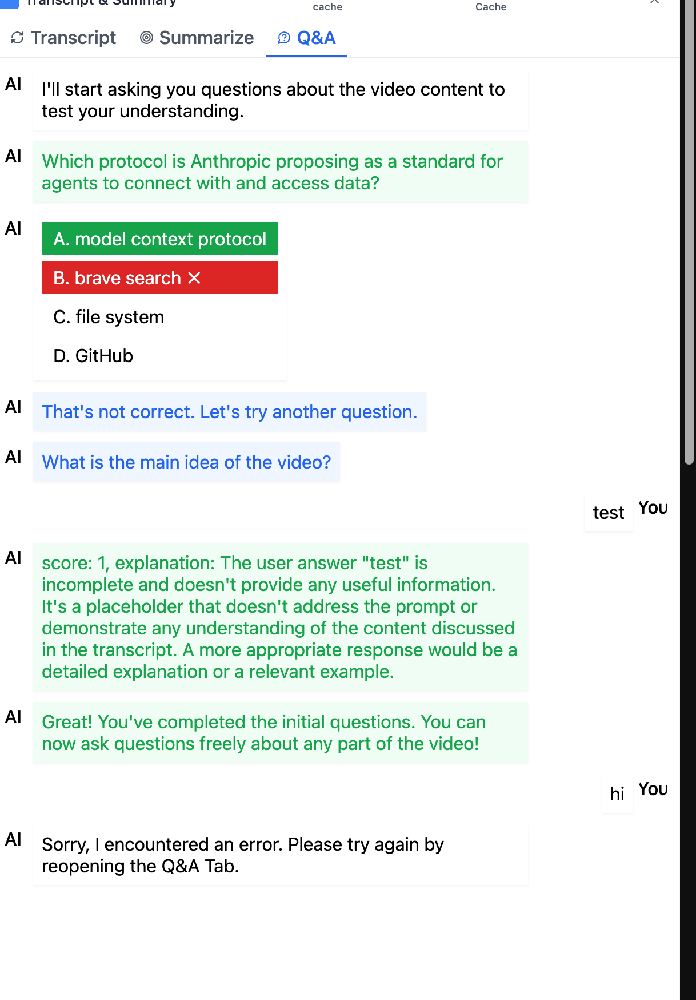
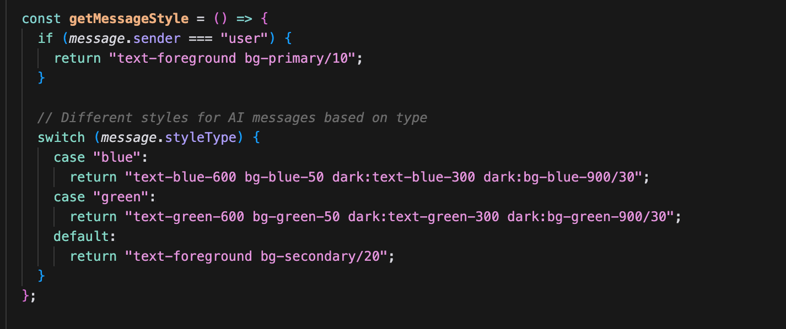
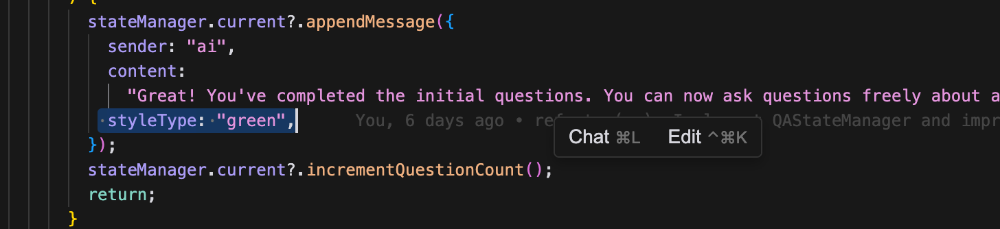

# feng

- detect chrome ai availablitiy UI [feng]
  - code checkAICapabilities
    - [ x ] more details solution
- transcript view [feng]
  - [ x ]remove transcript view extra span
  - [ x ] increase transcript view width
    
- QA view color [feng]
  
  
  
- Submission
  - build [feng]
    - [x]app info
    - app icon
    - Github readme [feng]
    - Description [feng]
- submission [nan]
  - Video [nan]
  - Article [nan]
