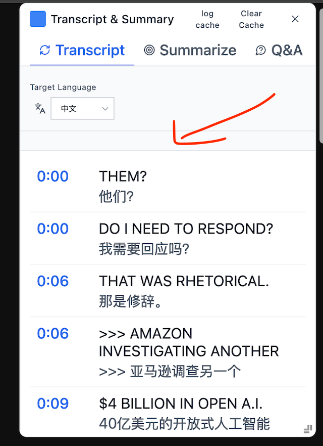

# feng

- detect chrome ai availablitiy UI [feng]
  - code checkAICapabilities
    - translate language (https://developer.chrome.com/docs/ai/translator-api#language-support)
      
- transcript view [feng]

  - remove transcript view extra span
  - increase transcript view width
    

- Submission
  - build [feng]
    - app info
    - app icon
    - Github readme [feng]
    - Description [feng]
- submission [nan]
  - Video [nan]
  - Article [nan]
