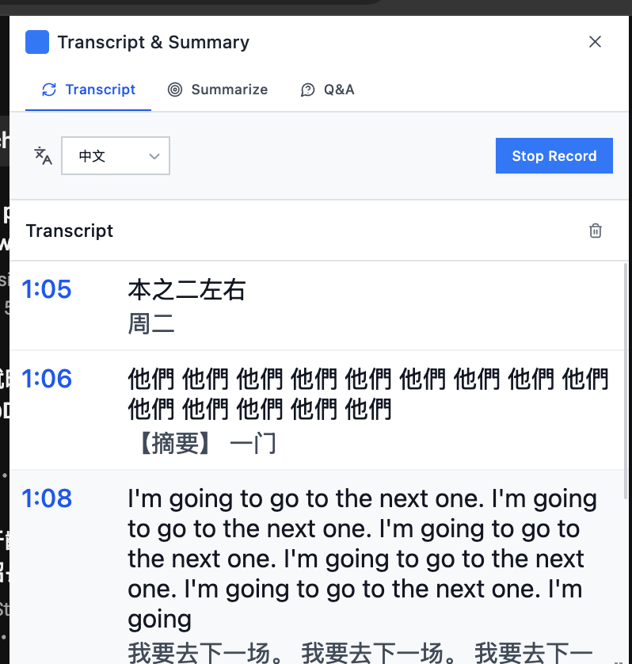

test url: https://www.youtube.com/watch?v=tF70o1Q8VkM&t=1s

# integrate transcript to translate

- can only transcribe english, need to add a transcribe language selector and translate language selector
  
- transcribe transcript cannot used in summary and QA

# UI fixes

- the summary timestamp is not hyperlink style
  
- dark mode?

# other issue

1. translate

- choose language
- full sentences
  

2. QA [nan]

- QA is not done
- support user to ask question

3. detect chrome ai availablitiy

# submission

1. Video
2. Description
3. Github readme
4. Article

11 28
