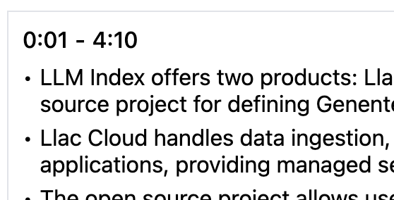

test url: https://www.youtube.com/watch?v=tF70o1Q8VkM&t=1s

# integrate transcript to translate

- P0 transcribe transcript cannot used in summary and QA [feng]
- P1 add translate language selector [feng]
- key not unique
  

# UI fixes

- the summary timestamp is not hyperlink style [feng]
  

# other issue

1. translate

2. summarize [nan]
   https://www.youtube.com/watch?v=Hiabp1GY8fA

3. QA [nan]

- QA is not done
- support user to ask question [nan]

3. detect chrome ai availablitiy UI [feng]

- checkAICapabilities
  

4. build [nan]

- app info
- app icon

# submission [nan]

1. Video
2. Description
3. Github readme
4. Article
